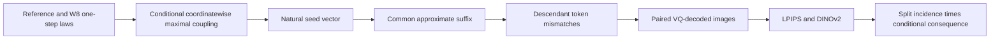

# Architecture and dataflow

The schedule is branch-independent and accepted Halton tokens are immutable. Event-addressed semantic keys separate reference-shared proposal draws from acceptance/residual draws and make unintended key reuse auditable.
